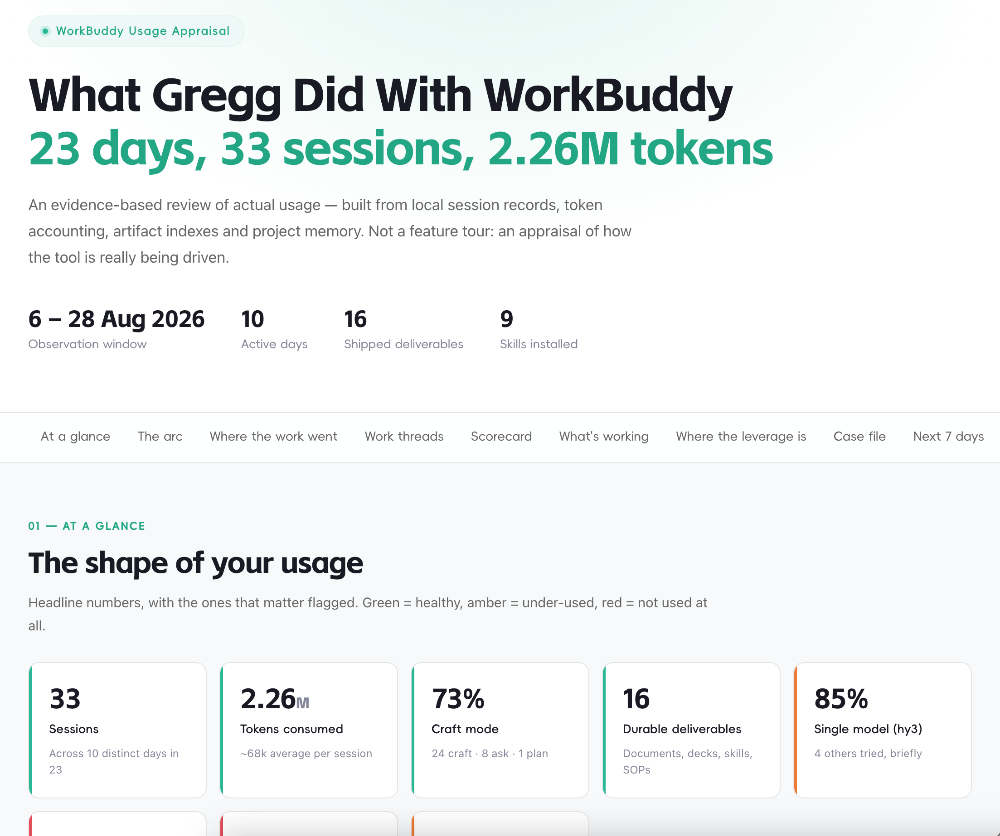

# workbuddy-insights

Generate an evidence-based **"What I did with WorkBuddy"** usage appraisal from **local state only** — the WorkBuddy equivalent of Microsoft's *What I did with Copilot*. Every claim is derived from data on disk (session DB, artifact index, usage log, project memory); nothing is inferred from the live conversation.



## What It Does

- **Windowed retrospective** — pulls your first and last session, then reports the whole span: sessions, active days, tokens, modes, models, experts, automations, and skills installed.
- **Work-thread grouping** — clusters sessions by project / working directory + topic and sums tokens per thread, so you see where the compute actually went.
- **Project-memory read-through** — reads every `<project>/.workbuddy-ai/memory/*.md` to capture the *why* and the *friction* that raw counts can't.
- **Deliverable verification** — cross-checks the artifact index against the filesystem; an indexed artifact that's missing on disk is a finding, not a footnote.
- **Hygiene & MCP audits** — greps transcripts for leaked API keys, and flags configured-but-unloaded MCP servers you have a standing instruction to use.
- **Six-dimension scorecard** — Artifact orientation, Institutional memory, Verification discipline, Orchestration, Operational hygiene, Platform surface. Each scored 0–10 with a cited evidence line.
- **Ranked gaps & next actions** — gaps ranked by return-on-effort, plus ≤5 sequenced next actions with effort tags.
- **Anti-sycophancy built in** — no strength without a citable data line; every inference is labelled; post-hoc narrative risk is stated explicitly.

## Install

Just tell WorkBuddy:

> Install workbuddy-insights skill from https://github.com/greggchen308/gc-skills/tree/main/workbuddy-insights

## Invoke

```
/workbuddy-insights
```

## Data Sources (all local, read-only)

| Source | Path | Yields |
|---|---|---|
| Session DB | `~/.workbuddy-ai/workbuddy.db` (sqlite3) | sessions, usage, automations, workspaces |
| Artifact index | `~/.workbuddy-ai/artifact-index/*.json` | every file produced, keyed by session id |
| Usage log | `~/.workbuddy-ai/usage-log.json` | skill + MCP usage dates, active days |
| Plans | `~/.workbuddy-ai/plans/*.md` | plan-mode artefacts |
| Teams | `~/.workbuddy-ai/teams/*/config.json` | multi-agent orchestration evidence |
| Project memory | `<project>/.workbuddy-ai/memory/*.md` | narrative of what was done and why |
| Skills | `~/.workbuddy-ai/skills/*/SKILL.md` | what's installed vs used |
| MCP config | `~/.workbuddy-ai/mcp.json` | configured connectors |

## How It Works

1. **Set the window** from the first/last session timestamps.
2. **Pull headline counts** — sessions, days, tokens, modes, models, experts, automations.
3. **Group into work threads** by `cwd` + topic; sum tokens per thread (a judgement call — stated in caveats).
4. **Read every project memory file** — the highest-value source in the whole exercise.
5. **Verify deliverables exist on disk** against the artifact index.
6. **Hygiene audit** — grep for leaked keys; check the secret-handling standard in `~/.workbuddy-ai/MEMORY.md`.
7. **MCP audit** — configured-vs-live; flag unloaded servers you rely on.
8. **Score six dimensions** 0–10 with cited evidence.
9. **Rank gaps by return-on-effort**, not severity.
10. **End with ≤5 sequenced actions**, each with an effort tag.

## Output

A single self-contained HTML file at `<workspace>/outputs/workbuddy-usage-appraisal.html`, rendered in the official workbuddy.ai brand visual language (mint-green `#28b894`, Alimama fonts, white/near-white surfaces) — then opened for review. Sections: hero + headline stats, at-a-glance stat cards, a 4-phase arc timeline, token bar chart, work-thread cards, scorecard, what's-working, leverage points, one failure post-mortem, next-7-days actions, and a method & caveats section.

## Notes & Caveats

- `last_activity_at - created_at` is **not** time-worked — reopened sessions span multiple days. Never report it as duration.
- The artifact index counts *records*, not unique files — de-duplicate by name; exclude memory / intermediate / `/tmp` scripts.
- The most instructive section is the post-mortem of an **abandoned** session — prefer it over another success story.

## See Also

- `SKILL.md` — full trigger conditions, sqlite query snippets, the six-dimension scoring rubric, and the complete visual-language token spec.
